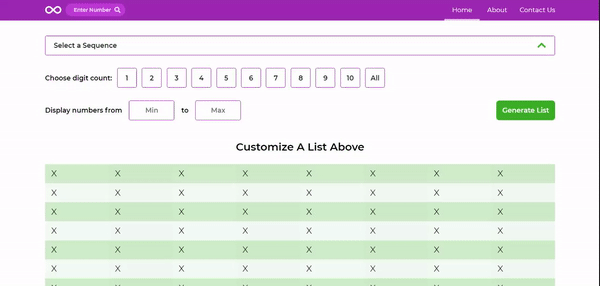
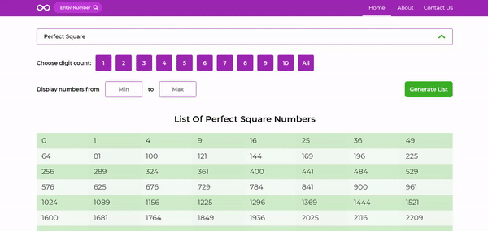

# List_Generator
This project enables generation of lists of numbers based on sequences. Lists of the following 5 sequences can be generated: Catalan, Fibonacci, Palindrome, Perfect Square and Prime.
Whereas these lists can be filtered by digit count and/or minimum and maximum values. </br> </br>
In addition, single numbers can be researched to check to which sequences they do and do not belong to. </br>
<a href="https://sequence-generator.com/">Visit Site</a>
## Demo
Generating list: </br>


Researching a number: <br/>


## Run Project Locally
* Clone or fork this repository.
* Open ```index.html``` in a web browser.

## Technologies Used
* Javascript
* HTML/CSS
* Gulp
  * [Gulp Plugins:](https://gulpjs.com/plugins/)
    * gulp-clean-css
    * gulp-concat
    * gulp-sourcemaps
           
